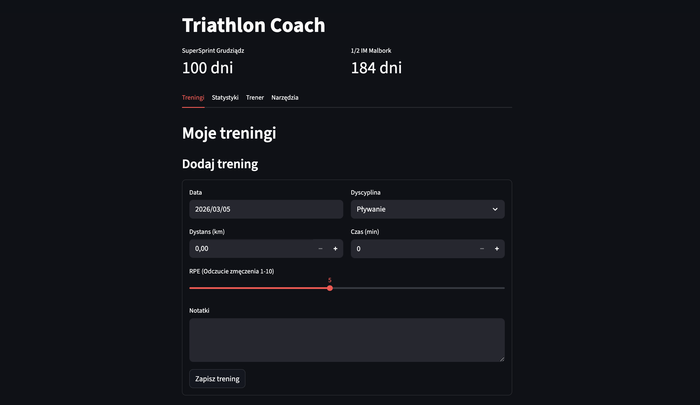
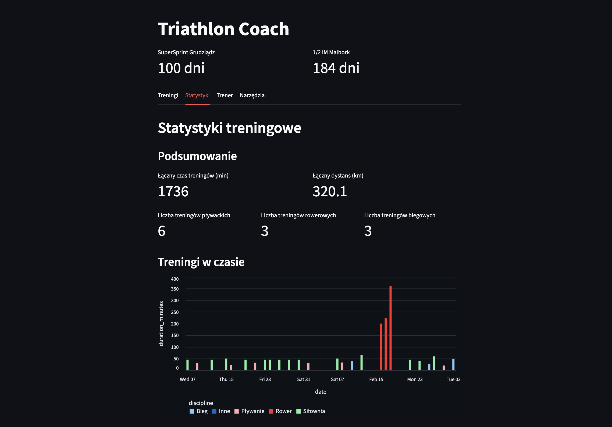
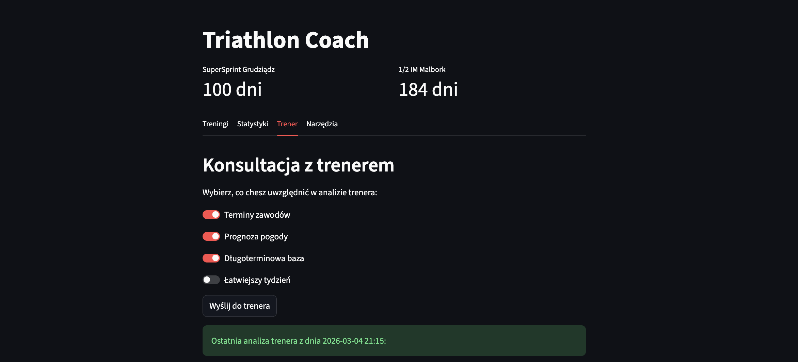

### Workout Logging

### Statistics

### Coach

### Sample coach advice (translated from Polish)
Hi. As your coach, I've analyzed your recent progress and historical data. We need to have an honest talk: your training volume is like a rollercoaster. After a massive week in mid-February (over 10 hours!), you've fallen into a deep slump. If you're thinking about the 1/2 IM in Malbork, this kind of irregularity is your biggest enemy.

Here is the analysis and action plan.

### 1. Summary of the past week (Feb 25 – Mar 03)

**Statistics:**
* **Total time:** 154 minutes (approx. 2.5h)
* **Disciplines:** 2x Run, 1x Swim, 1x Gym
* **Run volume:** 15.2 km
* **Swim volume:** 1.0 km
* **Average RPE:** approx. 6.0 (but the last run was a solid 8/10)
* **Intensity assessment:** The intensity was worryingly low compared to your capabilities from February, right up until your last run (Mar 03), where you really pushed it (RPE 8). This looks like an attempt to "make up" for lost time with one hard workout. That is a straight path to injury. The bike is missing – given your goal (1/2 IM), the bike is 50% of the success, and you need to start spinning regularly, especially since the weather is starting to work in your favor.

---

### 2. Plan for the next 7 days (Mar 04 – Mar 10)

We are taking advantage of a great weather window (11°C, no rain). It's time to take the bike out of the garage. Remember: after a hard session, you always get a day off, just as you requested.

| Date | Day | Discipline | Time (min) | Description / Goal | RPE |
| :--- | :--- | :--- | :--- | :--- | :--- |
| 04.03 | Wednesday | REST | - | Recovery after Tuesday's hard run (RPE 8). | - |
| 05.03 | Thursday | Gym | 60 | Full Body Workout (FBW). Focus on legs and core. | 6 |
| 06.03 | Friday | Bike (Outdoor) | 90 | First outdoor ride. Flat, cadence 85-95. Enjoy the sun. | 5 |
| 07.03 | Saturday | Swim | 45 | 200m warm-up, 10x50m technique, 4x200m race pace, 100m cool-down. | 6 |
| 08.03 | Sunday | Run (Long) | 70 | Easy Zone 2 run. Building base for Malbork. | 5 |
| 09.03 | Monday | REST | - | Well-deserved rest after the weekend. | - |
| 10.03 | Tuesday | Gym + Run | 45+20 | Gym (Upper body) + 20 min easy treadmill run (brick workout). | 6 |

---

### Coach's Notes:

* **Consistency, not intensity:** I am not interested in your speed records at this stage. I am interested in you checking off every workout in the table. The 1/2 IM in Malbork does not forgive training "spurts" once every two weeks.
* **Bike is the priority:** You have 11 degrees and zero rain. These are perfect conditions for March. Since you don't have an indoor trainer, every weather window like this must be utilized 100%. If the weather breaks – go to the stationary bike at the gym.
* **Listen to your body:** Your last run (RPE 8) was very intense. If you feel any pain in your shins or knees during Sunday's long run – stop and switch to walking.
* **SuperSprint Goal (June):** That's in just 3 months! You will need dynamics there. For now, we are building the "engine", but in April we will start shifting into higher gears.

Get to work. I want to see all sessions completed next week!